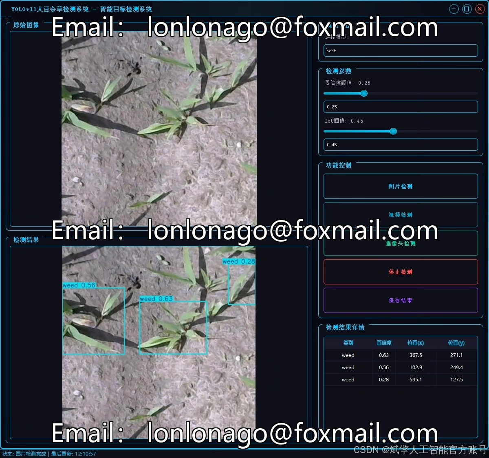
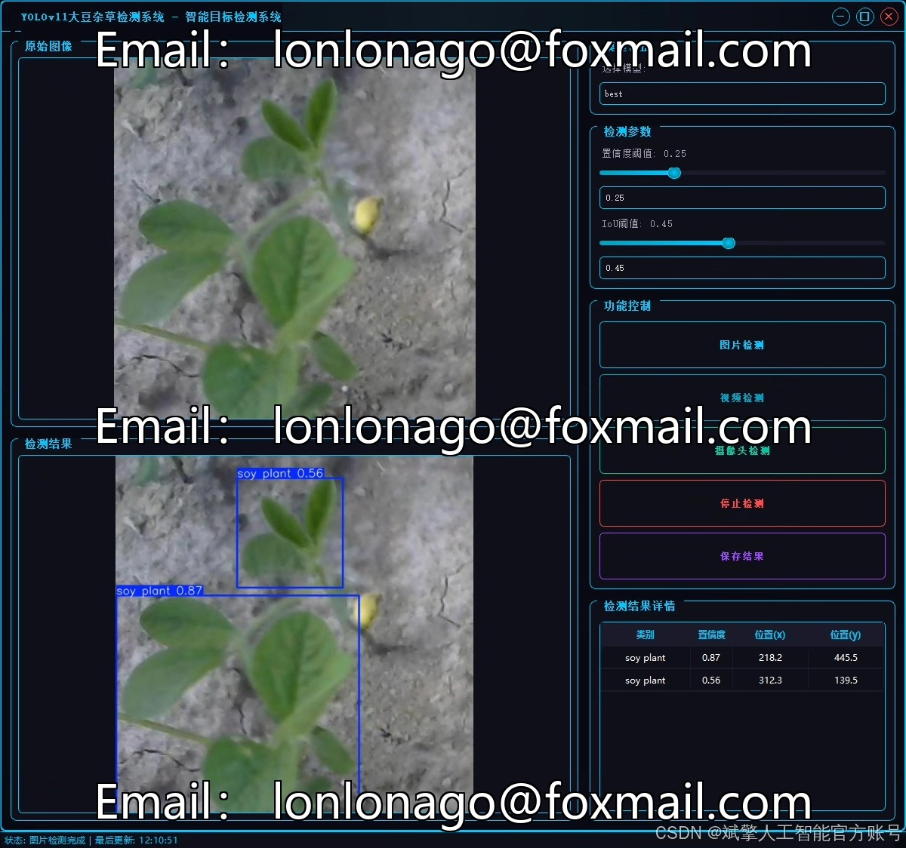
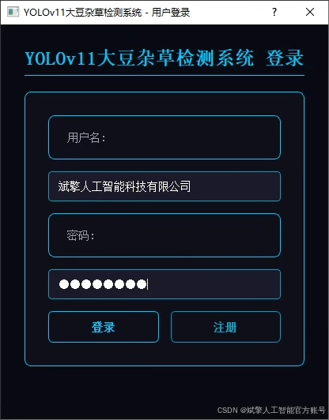
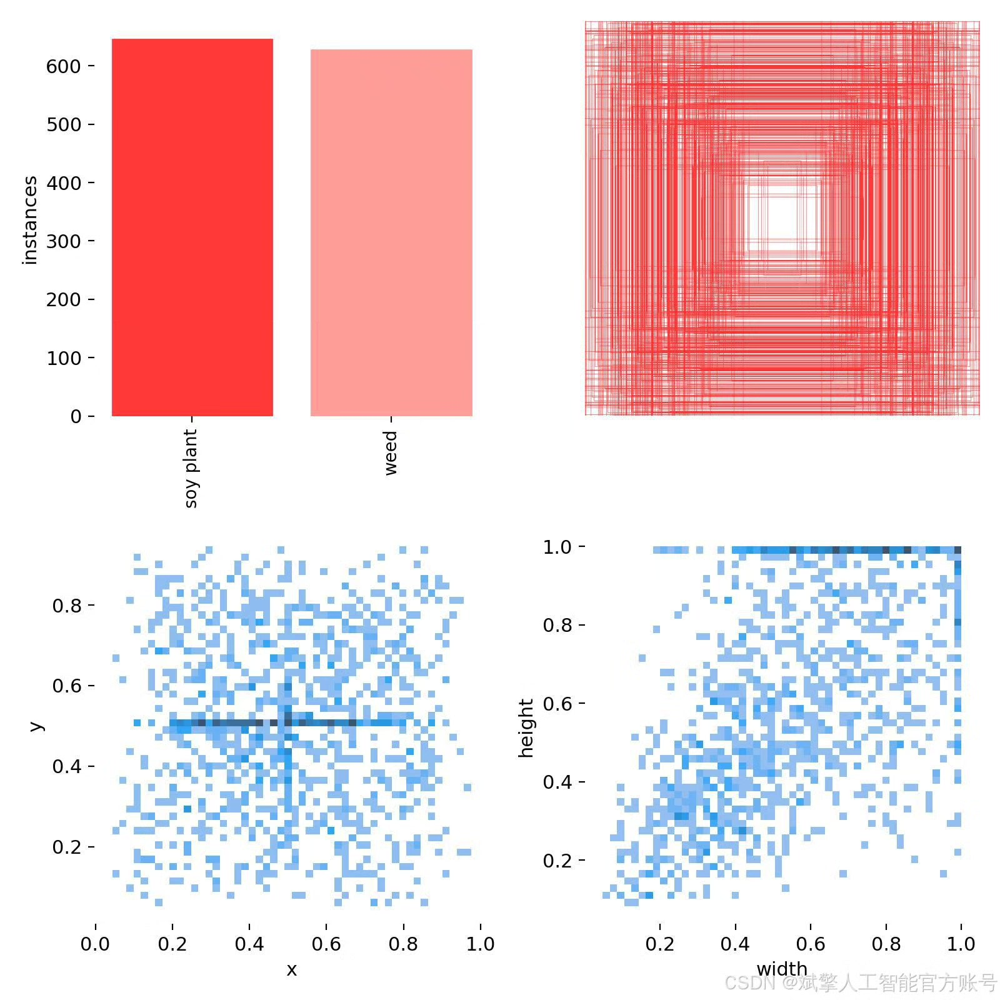
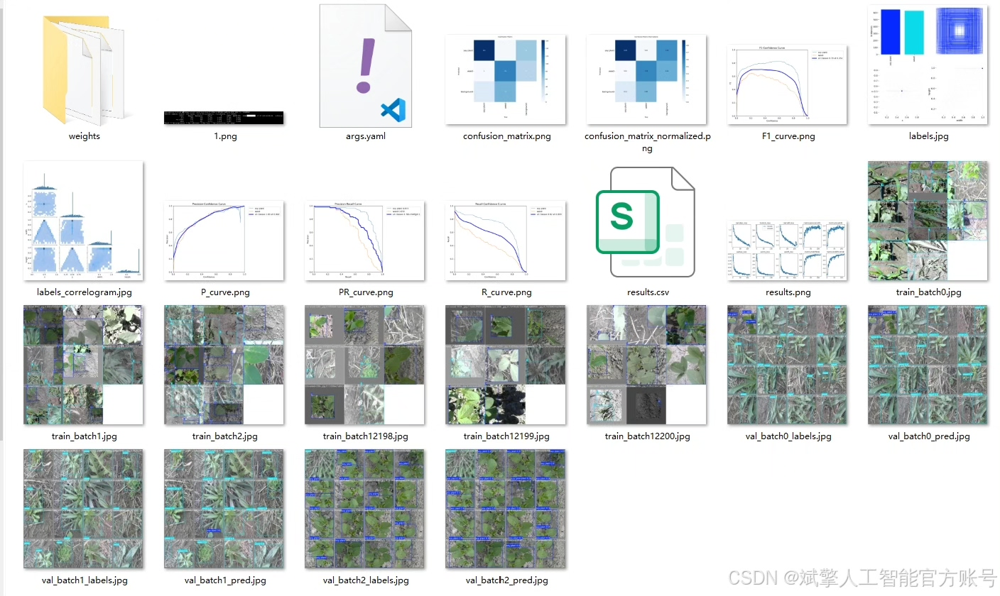
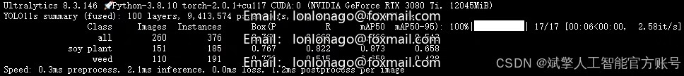
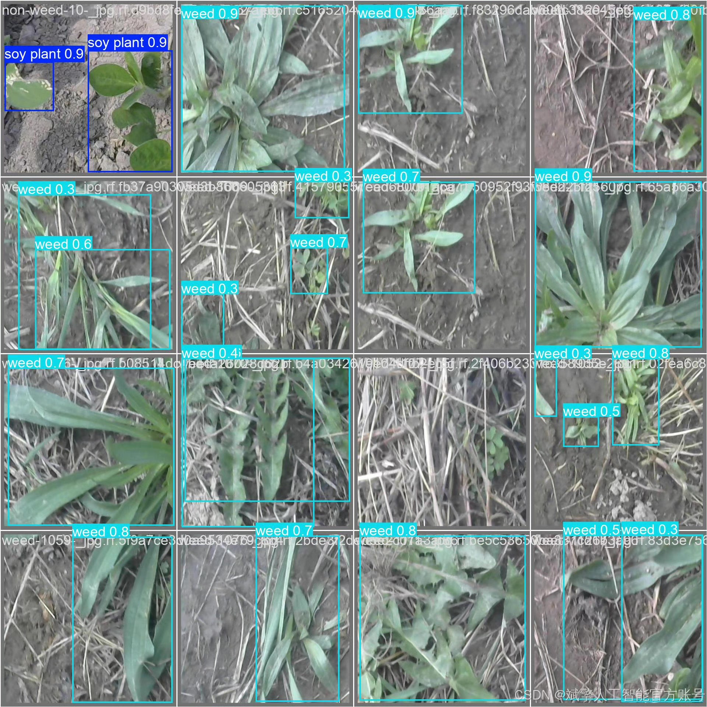
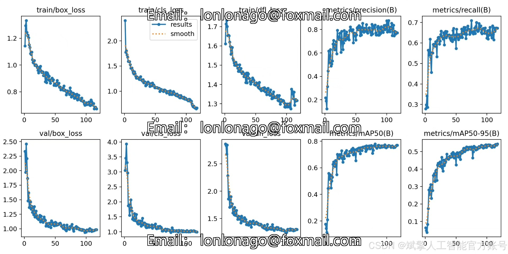
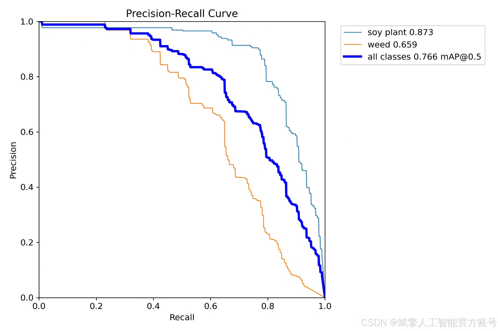

# YOLOv11 Soybean Weed Identification System

## Body

YOLOv11 is a simplified version of the YOLOv11 model, which is a deep learning-based object detection algorithm. It is used for real-time object detection in images. The YOLOv11 model is based on the YOLOv3 architecture and has been optimized for faster inference speed and better performance.

The YOLOv11 system consists of several components:

1. Data collection: The system collects data from various sources such as cameras, drones, and sensors to train the YOLOv11 model.

2. Preprocessing: The collected data is preprocessed to remove noise and artifacts, and then converted into a format that can be fed into the YOLOv11 model.

3. Model training: The preprocessed data is fed into the YOLOv11 model for training. The model learns to identify objects in the image and classify them based on their features.

4. Object detection: Once the model is trained, it can be used to detect objects in real-time. The system uses the trained model to analyze each frame of an image and identify the presence of objects.

5. Results display: The detected objects are displayed on the screen or printed out in a format that is easy to interpret.

Overall, the YOLOv11 system is a powerful tool for identifying and tracking objects in real-time, making it useful for applications such as agriculture, security, and surveillance.

(Full product description was not available from the source page.)

## Images

## Payment

Here is a pay link on Stripe ( https://buy.stripe.com/3cs8yP7sY87d0vu9AB ). Please contact me lonlonago@foxmail.com after funding $89, and I will send you a complete data files , thank you!

